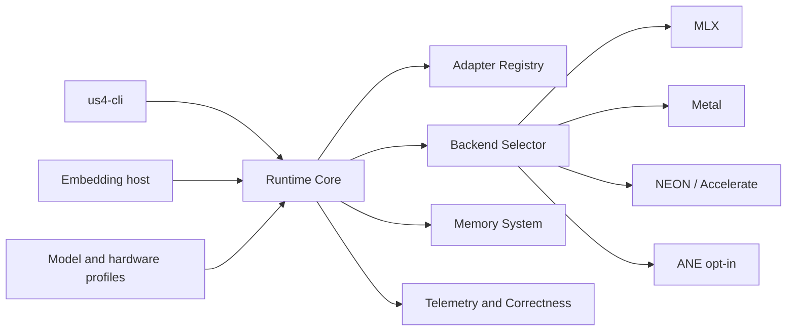
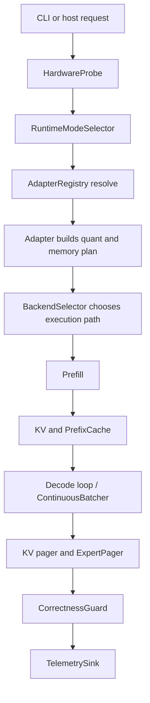

# Design - US4 V6 Apple Edition

## 1. Context

US4 V6 Apple Edition is a local runtime, not a web platform.

Its outer surfaces are:

- `us4-cli`
- embedding hosts such as local Apple apps
- optional local API shim in future sprints, if needed



## 2. Main boundaries

| Boundary | Responsibility |
|---|---|
| Interface | CLI parsing, config loading, JSON/text output |
| Runtime Core | session lifecycle, prefill/decode orchestration, policy enforcement |
| Model Adapters | family-specific layout, quant strategy, memory plan, capability flags |
| Execution Backends | MLX, Metal, NEON, scalar CPU, optional ANE paths |
| Memory System | KV lifecycle, prefix cache, SSD cold tier, expert paging |
| Validation and Telemetry | correctness gates, drift reports, throughput and memory metrics |

Dependencies point inward. Adapters do not own the scheduler. Backends do not define product policy.

## 3. Canonical runtime flow



## 4. Core contracts

### `RuntimeSession`

Owns:

- prompt state;
- generation options;
- KV ownership;
- mode transitions that can only degrade within the same session.

### `IUS4V6Adapter`

Each adapter declares:

- family and architecture type;
- supported features such as MoE, GQA, MLA, multimodal, ternary;
- recommended quant strategy per hardware profile;
- memory plan per runtime mode;
- backend capabilities and constraints.

### `BackendExecutor`

Responsible for:

- op dispatch;
- buffer ownership at the backend boundary;
- fallback to safer paths when drift or unsupported ops appear.

### `MemoryGovernor`

Responsible for:

- hot/warm/cold/summary transitions;
- memory pressure reactions;
- expert and KV eviction policy;
- preserving correctness while degrading gracefully.

### `CorrectnessGuard`

Responsible for:

- drift thresholds per task and benchmark profile;
- disabling aggressive paths when tolerance is exceeded;
- emitting explicit reasons for fallback.

## 5. Planned stack

| Layer | Technology |
|---|---|
| Language | C++20 |
| Build | CMake 3.27+ + Ninja |
| Primary tensor/runtime path | MLX |
| Custom acceleration | Metal |
| CPU fallback | NEON / Accelerate / scalar |
| Optional accelerator | ANE on M5+ |
| Unit and regression | GoogleTest + CTest |
| CLI E2E | Playwright |

## 6. Planned repo layout

```text
runtime/
  core/
  adapters/
  memory/
  kv/
  cache/
  moe/
  metal/
  mlx/
  neon/
  ane/
  speculative/
  tuning/
  telemetry/
  benchmarks/
```

## 7. MVP and phases

### MVP runtime slice

- `us4-cli --version`
- `us4-cli --probe`
- hardware probe
- runtime mode selection
- adapter contract
- Qwen/Gemma small dense baseline
- MLX primary path plus safe CPU fallback
- correctness fixtures for dense baseline

### Phase 2

- Metal measured kernels
- prefix cache
- unified-memory KV
- continuous batching baseline

### Phase 3

- MoE adapters
- expert pager
- speculative expert prefetch

### Phase 4

- speculative decoding
- ANE opt-in
- multimodal cache
- release hardening

## 8. Non-goals for architecture

- no symmetric multi-backend ideology; MLX is the default path;
- no performance optimization that outranks correctness;
- no giant frontier MoE as the first vertical slice;
- no new third-party dependency without explicit approval.

## 9. ADR map

Priority ADRs:

- `ADR-001-mlx-primary-backend.md`
- `ADR-002-runtime-boundaries-and-adapter-contract.md`

Future likely ADRs:

- KV tiering and SSD cold cache
- correctness thresholds and fallback policy
- ANE eligibility rules
