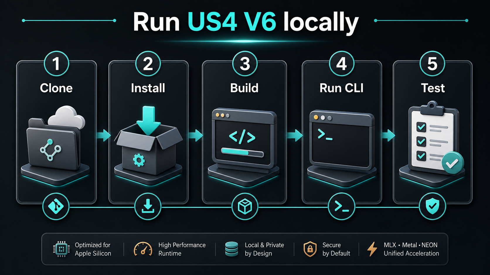
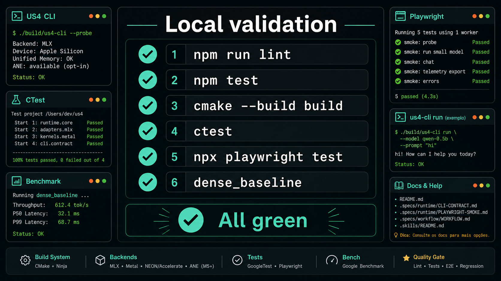

# US4 V6 - Apple Edition

> Universal State Runtime para inferencia LLM local em Apple Silicon.
> pt-BR. EN version: [README.md](README.md).


## Executar localmente

Este e o caminho mais direto para clonar, compilar, executar e validar o projeto na sua maquina.



### 1. Clone

```bash
git clone https://github.com/wesleysimplicio/us4-v6-simplicio-apple.git
cd us4-v6-simplicio-apple
```

### 2. Instale as ferramentas

Ferramentas minimas:

- Node.js 16.7 ou mais novo
- npm
- CMake 3.27 ou mais novo
- Ninja
- compilador C++20

Recomendado no macOS:

```bash
xcode-select --install
brew install cmake ninja node
npm ci
npx playwright install
```

Recomendado no Windows:

```powershell
npm ci
npx playwright install
```

No Windows, prefira rodar os comandos CMake nativos em um Visual Studio Developer shell.

### 3. Configure e compile

macOS/Linux:

```bash
cmake -S . -B build -G Ninja -DCMAKE_BUILD_TYPE=Release
cmake --build build --config Release
```

Windows PowerShell:

```powershell
cmake -S . -B build -G Ninja -DCMAKE_BUILD_TYPE=Release
cmake --build build --config Release
```

Se o Ninja nao estiver instalado, o CMake pode usar o gerador padrao da plataforma. Mantenha o mesmo diretorio `build`.

### 4. Rode a CLI

macOS/Linux:

```bash
./build/apps/us4-cli --probe
./build/apps/us4-cli run --model qwen-0.5b --prompt "hi" --max-tokens 8
./build/apps/us4-cli run --model qwen-0.5b --prompt "hi" --max-tokens 8 --json
```

Windows PowerShell:

```powershell
.\build\apps\us4-cli.exe --probe
.\build\apps\us4-cli.exe run --model qwen-0.5b --prompt "hi" --max-tokens 8
.\build\apps\us4-cli.exe run --model qwen-0.5b --prompt "hi" --max-tokens 8 --json
```

Exemplos uteis com fixtures:

```bash
./build/apps/us4-cli run --model-path tests/fixtures/models/qwen-0.5b/model.us4manifest --prompt "hi" --json
./build/apps/us4-cli run --model-path tests/fixtures/models/llama-3.1-8b --prompt "hello" --json
./build/apps/us4-cli run --model-path tests/fixtures/models/bitnet-b1.58-2b/model.us4manifest --backend neon --prompt "tiny" --json
```

### 5. Valide tudo



Rode os gates JavaScript rapidos:

```bash
npm run lint
npm test -- --coverage
npm run pack:dry
```

Rode build nativo e regressao:

```bash
cmake --build build --config Release
ctest --test-dir build --output-on-failure -C Release
```

Rode evidencia E2E da CLI:

```bash
npx playwright test --reporter=list,html tests/e2e/us4-cli.spec.ts
```

Rode evidencia de benchmark:

macOS/Linux:

```bash
./build/runtime/benchmarks/dense_baseline
./build/runtime/benchmarks/matrix_runner
```

Windows PowerShell:

```powershell
.\build\runtime\benchmarks\dense_baseline.exe
.\build\runtime\benchmarks\matrix_runner.exe
```

### Como saber que funcionou

- `us4-cli --probe` imprime capacidades de hardware/runtime.
- `us4-cli run ...` imprime tokens gerados pelas fixtures e telemetria explicita de backend.
- `ctest` mostra os testes nativos configurados passando.
- Playwright mostra os smoke tests da CLI passando e grava evidencia em `playwright-report/` e `test-results/`.
- `dense_baseline` imprime linhas de benchmark com backend solicitado, backend observado, fallback, token count e placeholders de corretude onde referencia externa ainda nao esta conectada.

Se o GoogleTest nao estiver instalado localmente, o CMake ainda compila os testes `smoke` e `native contract runner` e avisa que os testes especificos de GTest foram pulados.

## O que este repo eh

Este repositorio e a base de planejamento e bootstrap do **US4 V6 Apple Edition**, a edicao Apple Silicon do Universal State Runtime.

Hoje ele contem:

1. a **camada llm-project-mapper/bootstrap**, usada para estruturar trabalho com agentes;
2. o **planejamento do projeto** em `.specs/`;
3. o scaffold nativo em `runtime/`;
4. a CLI em `apps/cli`;
5. caminhos de unit, contrato nativo, Playwright e benchmark.

Fonte de referencia: [US4-V6-simplicio.md](US4-V6-simplicio.md).

## Escopo do produto

O US4 V6 Apple Edition mira inferencia local para:

- adapters dense: Qwen, Llama, Gemma;
- adapters MoE: DeepSeek, Kimi, MiniMax, GLM;
- adapters low-memory: BitNet e PT-BitNet ternary;
- backends Apple: MLX, Metal, NEON/Accelerate e ANE opcional em M5+.

O produto eh explicitamente:

- single-machine first;
- correctness-first antes de qualquer claim de performance;
- CLI + biblioteca, nao app GUI;
- especifico para Apple nesta edicao.

## Estado atual do repo

**O planejamento e o scaffold de runtime agora existem no nivel de projeto.**

- Os docs de produto definem visao, dominio, personas, modos de runtime e alvos de compatibilidade.
- Os docs de arquitetura definem boundaries do runtime, contratos centrais e padroes de codigo para C++/Metal/MLX.
- Os docs de workflow explicam como a implementacao passa por task, DoD, PR e release gates.
- Runtime, CLI, fixtures, benchmarks e testes E2E estao presentes.
- Issues do GitHub estao sincronizadas com os arquivos locais de sprint.

## Stack planejada

- C++20 + CMake + Ninja
- MLX como caminho primario de tensor/runtime no Apple Silicon
- Metal para kernels quentes medidos que o MLX nao cobre bem
- NEON / Accelerate como fallback de CPU
- ANE como caminho opt-in em M5+
- GoogleTest + CTest para unit e regression
- Playwright para evidencia E2E da CLI

## Modelo de trabalho

O repo segue o ecossistema `AGENTS.md`. As instrucoes centrais vivem em:

- [AGENTS.md](AGENTS.md)
- [CLAUDE.md](CLAUDE.md)
- [.github/copilot-instructions.md](.github/copilot-instructions.md)

Todo trabalho tecnico deve seguir o loop:

`ler task -> planejar -> editar -> format/lint -> unit -> e2e -> regression -> corrigir -> commit -> PR`

## Roadmap

| Sprint | Tema |
|---|---|
| 01 | Foundations and Skeleton |
| 02 | CPU Scalar Baseline |
| 03 | MLX and Metal Skeleton |
| 04 | NEON Hot Paths |
| 05 | BitNet and Ternary |
| 06 | KV Memory Architecture |
| 07 | Llama Adapter |
| 08 | MoE Foundation |
| 09 | MoE Advanced |
| 10 | Continuous Batching and Speculative Decoding |
| 11 | ANE M5+ Offload |
| 12 | Auto-Tune and v1.0 Release |

Detalhes:

- [.specs/sprints/BACKLOG.md](.specs/sprints/BACKLOG.md)
- [.specs/sprints/TIMELINE.md](.specs/sprints/TIMELINE.md)

## Layout do repo hoje

```text
.specs/        fonte de verdade do planejamento
.agents/       agentes customizados
.skills/       skills reutilizaveis
.claude/       hooks/settings do Claude
.codex/        hooks/settings do Codex
.github/       CI/DoD do starter e templates
apps/          entrada da CLI nativa
bin/           CLI do llm-project-mapper
runtime/       runtime C++, backends, adapters, tuning, telemetria, benchmarks
test/          self-tests do starter
tests/         testes de contrato nativos e E2E Playwright da CLI
```

## Fora de escopo

- inferencia em nuvem ou distribuida;
- treino ou fine-tuning;
- hardware nao-Apple nesta edicao;
- shell GUI antes de CLI e biblioteca estarem estaveis.
